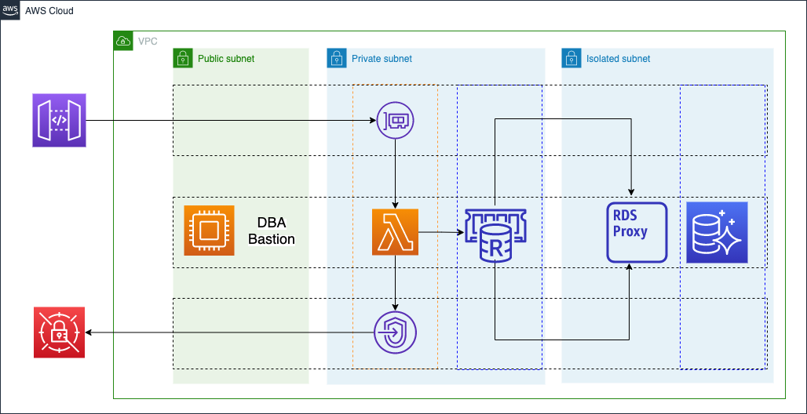
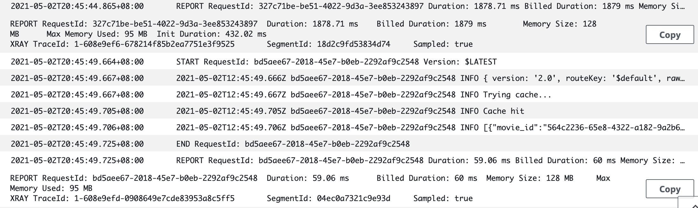

# Database caching example with ElastiCache Redis and Amazon Aurora

This is an example applicaion showing how to use ElastiCache for Redis to accelerate database queries.

## Arcihtecture



## Deployment

* In `bin/aurora-elasticache-example.ts`, enter your AWS account Id

* Run `cdk deploy --require-approval never`

* Log into the Bastion EC2, run the SQL files at `src/setup-db`, this should load your DB with dummy data

## Test the API

In CloudFormation console, note the API Gateway URL, use curl to launch a request to the `popularMovies` path, example like so:
```
curl https://xxxxxxx.execute-api.ap-northeast-1.amazonaws.com/popularMovies
```

This API displays the top 10 popular movies from the databse.

Test it twice within a minute, results can be different, if there is a cache miss, the results from Aurora Postgres is saved into Redis as base64-encoded String with 60s TTL, so the next request within a minute will hit the cache.

<b>Note the difference below:</b>

